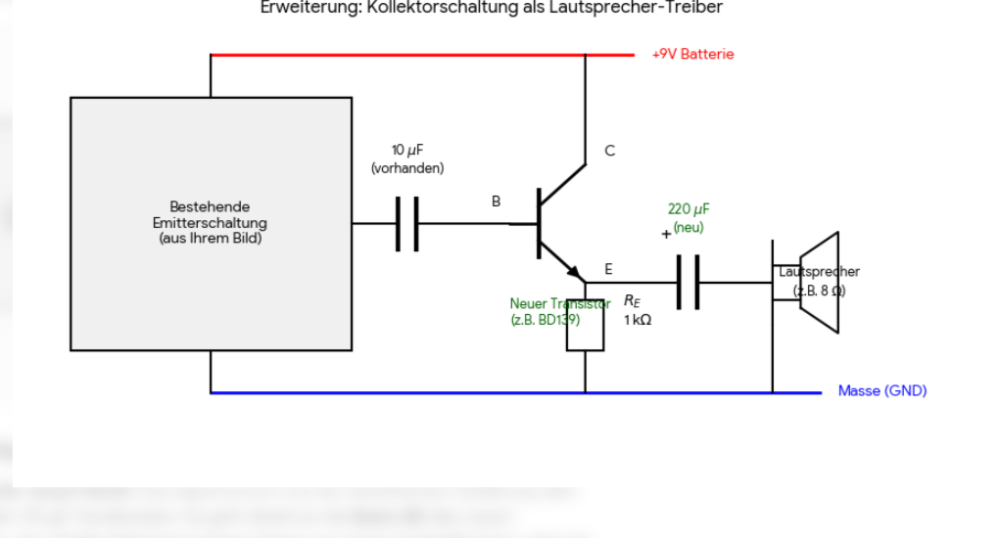

# Anleitung: Impedanzanpassung mit einer Klasse-A-Emitterfolger-Endstufe

Diese Anleitung erklärt detailliert, wie du deinen vorhandenen NF-Vorverstärker (aus deiner LSimulIDE/Falstad-Simulation) erfolgreich an einen niederohmigen Lautsprecher anpassen kannst, indem du eine **Klasse-A-Emitterfolger-Endstufe** (Kollektorschaltung) als Stromtreiber dazwischenschaltest.

---

## 1. Das Problem: Warum bricht das Signal ohne Endstufe zusammen?

In deiner Vorverstärker-Schaltung wird das Signal über den Kollektorwiderstand **$R_C = 3\text{ k}\Omega$** abgegriffen. Dieser Widerstand stellt den Ausgangswiderstand (Quellimpedanz $R_{out}$) des Vorverstärkers dar.

Schließt man nun einen Lautsprecher mit einer Impedanz von nur **$R_L = 8\ \Omega$** direkt an den Koppelkondensator an, entsteht ein extrem unvorteilhafter Spannungsteiler:

$$\text{Spannungsverhältnis} = \frac{R_L}{R_C + R_L} = \frac{8\ \Omega}{3000\ \Omega + 8\ \Omega} \approx 0{,}0026\ \ (0{,}26\%)$$

### Die Folge:
* **Massiver Spannungsverlust:** Das mühsam vorverstärkte Signal bricht auf **unter 0,3%** seiner ursprünglichen Amplitude zusammen (eine Dämpfung von ca. **$-51\text{ dB}$**). Der Lautsprecher bleibt praktisch stumm.
* **Verzerrungen und Bassverlust:** Der Ausgangskoppelkondensator ($10\ \mu\text{F}$) bildet mit dem $8\ \Omega$ Lautsprecher einen Hochpassfilter mit einer Grenzfrequenz von stolzen **$1989\text{ Hz}$**. Alle Frequenzen darunter (Bass und tiefe Mitten) werden komplett abgeschnitten!

---

## 2. Die Lösung: Der Klasse-A-Emitterfolger (Kollektorschaltung)

Um das Signal verlustfrei an den Lautsprecher zu übertragen, benötigen wir einen **Impedanzwandler**. Dieser muss:
1. Einen **sehr hohen Eingangswiderstand** besitzen, um den Vorverstärker nicht zu belasten.
2. Einen **sehr geringen Ausgangswiderstand** besitzen, um den $8\ \Omega$ Lautsprecher mühelos anzutreiben.

Der **Klasse-A-Emitterfolger** erfüllt genau diese Anforderungen. Er liefert zwar keine nennenswerte Spannungsverstärkung ($A_v \approx 0{,}98$), dafür aber eine enorme **Strom- und Leistungsverstärkung**.

---

## 3. Schaltplan der Endstufe (Anschlussplan)

