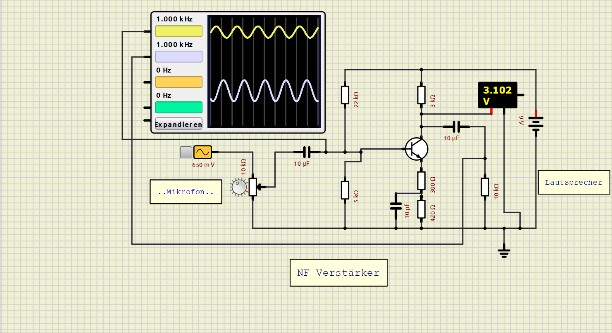

  

# NF-Verstärker – Mikrofonverstärker mit NPN-Transistor

Ein einstufiger Niederfrequenz-(NF-)Verstärker zur **originalgetreuen Verstärkung schwacher Audiosignale** (z. B. eines Mikrofons), aufgebaut mit einem NPN-Transistor in Emitterschaltung. Das Projekt wurde als Schaltung entworfen und anschließend simuliert.

---

## 📖 Worum geht es?

Schwache Audiosignale – etwa von einem Mikrofon – sollen verstärkt werden, **ohne** dass dabei Verzerrungen entstehen. Genau das leistet diese Schaltung: Sie hebt den Pegel des Eingangssignals deutlich an und gibt das verstärkte Signal originalgetreu an einen Lautsprecher weiter.

Im Oszilloskop ist gut zu erkennen, wie aus dem **kleinen Eingangssignal** (obere Kurve) ein **deutlich größeres Ausgangssignal** (untere Kurve) wird – bei gleicher Form und Frequenz.

## ⚙️ Funktionsweise

### 1. Das Problem: die Schwellspannung
Ein NPN-Transistor benötigt an seiner Basis-Emitter-Strecke eine **Schwellspannung von ca. 0,7 V**, bevor er leitet. Ein reines Mikrofonsignal enthält jedoch auch **negative Halbwellen**. Würde man es direkt anlegen, würde die untere Halbwelle "abgeschnitten" – das Signal wäre **verzerrt**.

### 2. Die Lösung: Biasing (Vorspannung)
Über einen **Spannungsteiler** an der Basis (22 kΩ / 5 kΩ) wird dem Wechselsignal eine **Gleichspannungskomponente** überlagert. Dadurch liegt das Signal dauerhaft **oberhalb der Schwellspannung** – der Transistor leitet immer, und beide Halbwellen werden sauber übertragen.

### 3. Der Arbeitspunkt
Der Transistor wird so eingestellt, dass er **mittig im Kennlinienfeld** arbeitet. So kann der Basisstrom in **beide Richtungen** aussteuern – das ermöglicht die **maximale Aussteuerung ohne Verzerrung**. Im Aufbau wird der eingestellte Arbeitspunkt mit dem Multimeter kontrolliert (gemessen: **≈ 3,1 V**).

### 4. Die Auskopplung
Ein **Koppelkondensator** am Ausgang (10 µF) blockiert die Gleichspannung und gibt **nur das verstärkte Wechselsignal (AC)** an den Lautsprecher weiter. Ebenso wird das Eingangssignal über einen Koppelkondensator galvanisch getrennt eingespeist.

## 🔩 Bauteile

| Bauteil | Wert | Funktion |
|---|---|---|
| Transistor | NPN | Verstärkerelement (Emitterschaltung) |
| Versorgungsspannung | 9 V | Betriebsspannung |
| Potentiometer | 10 kΩ | Einstellung des Eingangspegels (Lautstärke) |
| Koppelkondensator (Eingang) | 10 µF | Gleichspannungstrennung des Eingangssignals |
| Basis-Spannungsteiler R1 / R2 | 22 kΩ / 5 kΩ | Vorspannung (Biasing) / Arbeitspunkt |
| Kollektorwiderstand | 3 kΩ | Arbeitswiderstand, Spannungsverstärkung |
| Emitterwiderstände | 300 Ω + 420 Ω | Arbeitspunktstabilisierung / Gegenkopplung |
| Emitterkondensator | 10 µF | Wechselstrom-Überbrückung (Verstärkungseinstellung) |
| Koppelkondensator (Ausgang) | 10 µF | Gleichspannungstrennung zum Lautsprecher |
| Lastwiderstand | 10 kΩ | Last / Lautsprecher-Kopplung |

## 🧪 Simulation

Die Schaltung wurde in einem Schaltungssimulator aufgebaut und mit folgenden Messgeräten überprüft:

- **Funktionsgenerator** als Signalquelle (Mikrofon-Ersatz): Sinussignal **1 kHz**, ca. **650 mV**
- **Oszilloskop** zur Darstellung von Ein- und Ausgangssignal im direkten Vergleich
- **Multimeter** zur Kontrolle des Arbeitspunkts (**≈ 3,1 V**)

Das Oszilloskop bestätigt: Das Ausgangssignal ist gegenüber dem Eingang **deutlich vergrößert**, **formtreu** und **ohne sichtbare Verzerrung**.

## 🚀 Nachbau / Verwendung

1. Repository klonen oder herunterladen.
2. Schaltung anhand des Schaltbilds in einem Simulator (oder real auf einem Steckbrett) aufbauen.
3. Funktionsgenerator/Mikrofon an den Eingang anschließen, 9 V Versorgung anlegen.
4. Mit dem Potentiometer den Eingangspegel einstellen und das Ergebnis am Oszilloskop / Lautsprecher prüfen.

## 👤 Autor

**R. Wermeling** · Februar 2026

---

*Grundlagen der analogen Schaltungstechnik – praktisch demonstriert an einem Mikrofonverstärker.*
